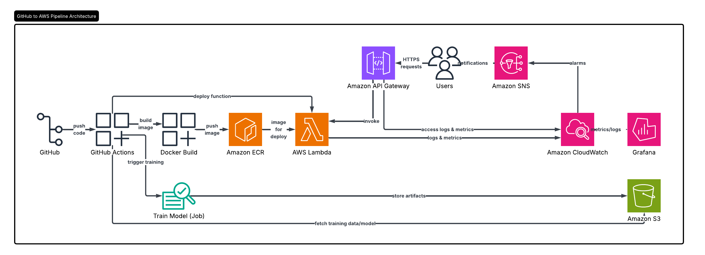
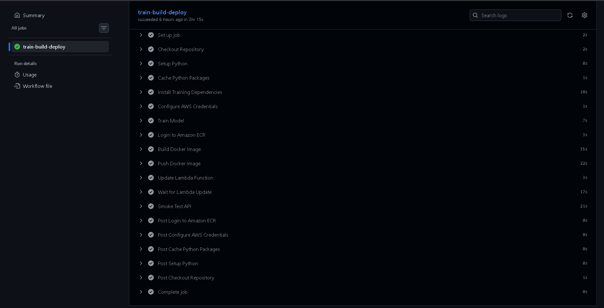
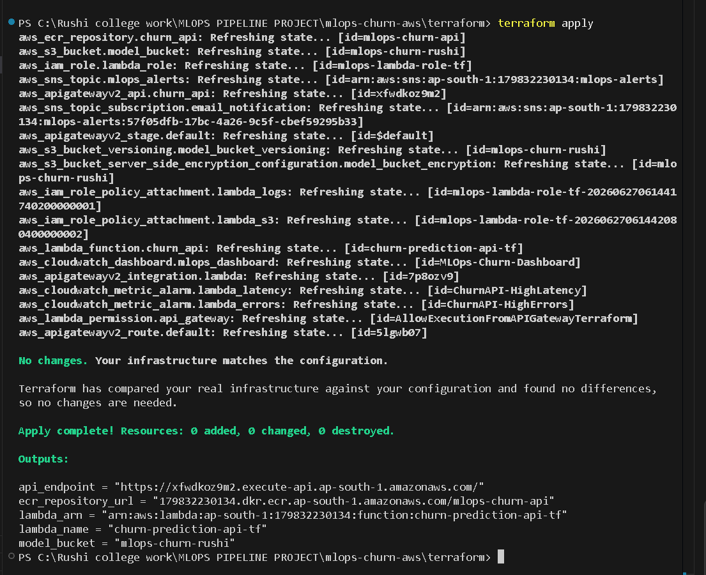
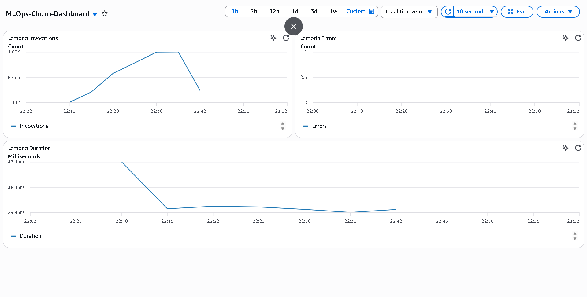
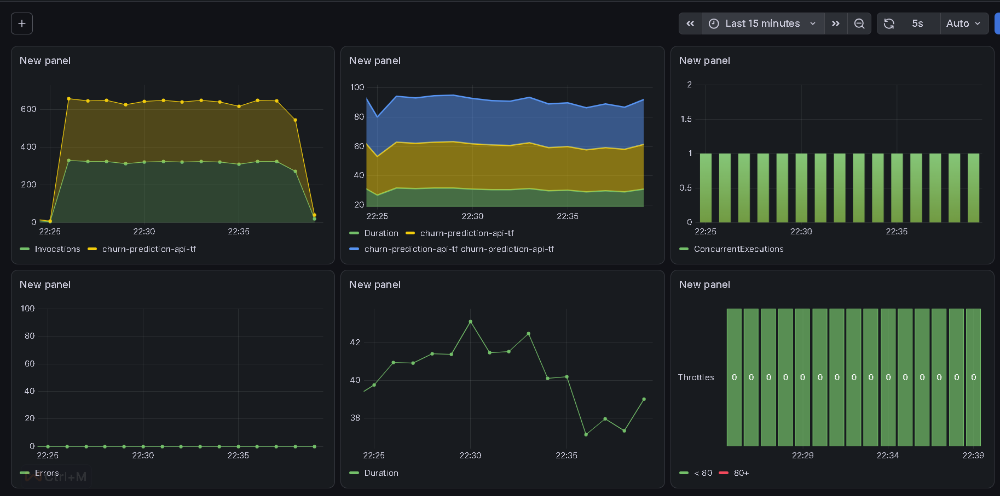
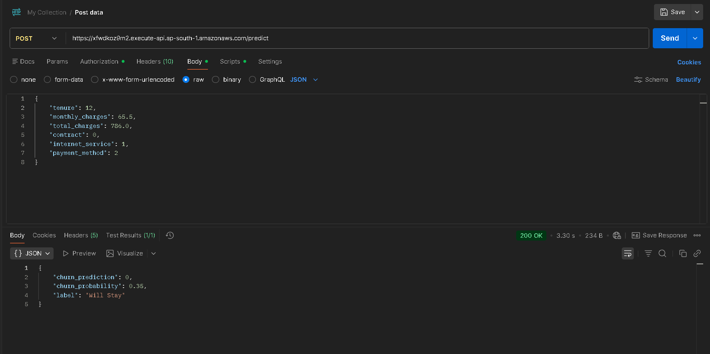

# 🚀 Automated MLOps Pipeline for Customer Churn Prediction

An end-to-end **MLOps pipeline** that automates machine learning model training, deployment, infrastructure provisioning, CI/CD, monitoring, and alerting on AWS.

## 📌 Project Overview

This project predicts customer churn using a Machine Learning model deployed as a serverless REST API on AWS. The complete infrastructure is managed using Terraform, deployment is automated using GitHub Actions, and monitoring is implemented using CloudWatch and Grafana.

---

# 🏗️ Architecture

```
                GitHub Repository
                        │
                        ▼
              GitHub Actions CI/CD
                        │
                        ▼
                Train ML Model
                        │
                        ▼
              Upload Model to Amazon S3
                        │
                        ▼
              Build Docker Image
                        │
                        ▼
                 Push Image to Amazon ECR
                        │
                        ▼
            Update AWS Lambda Function
                        │
                        ▼
               Amazon API Gateway
                        │
                        ▼
                 Customer Requests
                        │
                        ▼
                 Churn Prediction
                        │
                        ▼
     CloudWatch Metrics & Logs
                        │
                        ▼
       SNS Alerts + Grafana Dashboard
```

---
## 🏗️ Architecture



## 🚀 GitHub Actions



---

## Terraform Deployment



---

## Lambda Function


---


## CloudWatch Dashboard



---

## Grafana Dashboard



---


## API Response



# ✨ Features

- Customer Churn Prediction API
- Automated Model Training
- Dockerized ML Inference
- AWS Lambda Container Deployment
- Amazon API Gateway
- Amazon S3 Model Storage
- Amazon ECR Container Registry
- Infrastructure as Code using Terraform
- GitHub Actions CI/CD Pipeline
- CloudWatch Monitoring
- SNS Email Alerts
- Grafana Dashboard
- Fully Automated Deployment Pipeline

---

# 🛠️ Tech Stack

## Machine Learning

- Python
- Scikit-Learn
- Pandas
- NumPy
- Joblib

## Cloud

- AWS Lambda
- Amazon S3
- Amazon ECR
- Amazon API Gateway
- Amazon CloudWatch
- Amazon SNS
- IAM

## DevOps

- Docker
- Terraform
- GitHub Actions

## Monitoring

- CloudWatch
- Grafana

---

# 📁 Project Structure

```
Automated-MLOps-Pipeline-for-Customer-Churn-Prediction
│
├── .github/
│   └── workflows/
│       └── mlops-pipeline.yml
│
├── mlops-churn-aws/
│   ├── app/
│   │   ├── app.py
│   │   ├── Dockerfile
│   │   └── requirements.txt
│   │
│   ├── model/
│   │   ├── train.py
│   │   ├── churn_model.pkl
│   │   └── requirements.txt
│   │
│   ├── data/
│   │   └── WA_Fn-UseC_-Telco-Customer-Churn.csv
│   │
│   ├── terraform/
│   │   ├── provider.tf
│   │   ├── variables.tf
│   │   ├── s3.tf
│   │   ├── ecr.tf
│   │   ├── iam.tf
│   │   ├── lambda.tf
│   │   ├── api_gateway.tf
│   │   ├── monitoring.tf
│   │   ├── sns.tf
│   │   └── outputs.tf
│   │
│   └── README.md
```

---

# 🚀 Deployment Workflow

```
Git Push
    │
    ▼
GitHub Actions
    │
    ├── Install Dependencies
    ├── Train ML Model
    ├── Upload Model to S3
    ├── Build Docker Image
    ├── Push Image to Amazon ECR
    ├── Update AWS Lambda
    ├── Wait for Deployment
    └── Smoke Test API
```

---

# 📊 Monitoring

The application is monitored using CloudWatch and Grafana.

### CloudWatch Metrics

- Invocations
- Errors
- Duration
- P95 Latency
- P99 Latency
- Throttles
- Concurrent Executions

### Alerts

SNS Email Notifications are triggered for:

- High Error Rate
- High Latency

---

# 📈 Grafana Dashboard

The dashboard visualizes:

- 📈 Lambda Invocations
- ❌ Lambda Errors
- ⏱ Average Duration
- 🚀 P95 Latency
- ⚠️ Throttles
- 💾 Concurrent Executions

> **Add your Grafana dashboard screenshot here**

```
images/grafana-dashboard.png
```

---

# ☁️ Terraform Infrastructure

Terraform provisions:

- Amazon S3
- Amazon ECR
- IAM Roles
- AWS Lambda
- API Gateway
- CloudWatch Alarms
- SNS Topic
- CloudWatch Dashboard

Deploy using:

```bash
terraform init
terraform plan
terraform apply
```

---

# 🔄 CI/CD Pipeline

GitHub Actions automatically:

- Retrains the ML model
- Uploads the model to S3
- Builds Docker Image
- Pushes Image to ECR
- Updates Lambda
- Performs Smoke Testing

---

# 📦 API Endpoint

```
POST /predict
```

Example Request

```json
{
  "tenure": 12,
  "monthly_charges": 65.5,
  "total_charges": 786.0,
  "contract": 0,
  "internet_service": 1,
  "payment_method": 2
}
```

Example Response

```json
{
  "churn_prediction": 0,
  "churn_probability": 0.35,
  "label": "Will Stay"
}
```

---

# 📸 Screenshots

Add screenshots of:

- AWS Architecture
- Terraform Apply
- GitHub Actions
- Lambda Console
- CloudWatch Dashboard
- Grafana Dashboard
- api-call

---

# 📚 Skills Demonstrated

- Machine Learning
- MLOps
- AWS Cloud
- Docker
- Terraform
- Infrastructure as Code
- GitHub Actions
- CI/CD
- Serverless Computing
- Cloud Monitoring
- DevOps
- Observability

---

# 👨‍💻 Author

**Rushi Hansora**

- GitHub: https://github.com/Rushi-Hansora
- LinkedIn: https://www.linkedin.com/in/rushi-hansora-971724288/

---

# ⭐ If you found this project useful, please consider giving it a star!